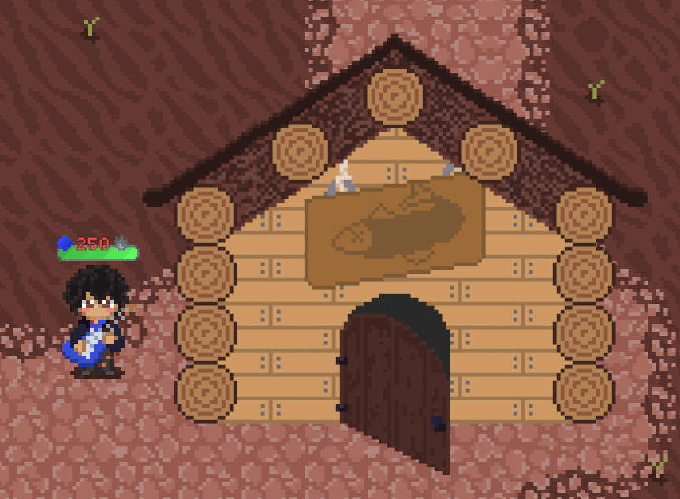

# Dream MOBA

> **Working title**

An online 3v3 MOBA where a hero's profession or hobby becomes the core rule of their gameplay.

A guitarist relies on precision.
A chess player controls space.
A tarot reader relies on probability.
A football player controls the ball.

A personal indie project built for learning, experimenting and eventually turning these ideas into a playable game.

> 🚧 **Currently in active prototype development.**

---

## 🎥 Gameplay

### Combat


### Building Occlusion



---

## 🎮 The Idea

**What if a person's profession or hobby became the main rule of their gameplay?**

Instead of giving every hero a conventional set of abilities, each one is built around a different real-world concept.

| Hero              | Core idea           |
| ----------------- | ------------------- |
| 🎸 Guitarist      | Precision           |
| 🔮 Tarot Reader   | Probability         |
| ♟️ Chess Player   | Positioning         |
| ⚽ Football Player | Object manipulation |
| 🎨 Artist         | Creating space      |
| 📷 Photographer   | Information & time  |

The goal is to make heroes feel fundamentally different from each other.

---

## 🧪 Current Prototype

<details>
<summary>The current focus is the <b>multiplayer and combat foundation</b>.</summary>

- Online multiplayer
- Lobby for up to 6 players
- Team system
- Playable Guitarist
- Abilities & passive abilities
- Damage, healing and status effects
- Respawning & respawn protection
- 🔥 Streak system
- Projectile system
- Building occlusion & dynamic outlines
- Custom shaders
- 2D map and environment
- UI and audio settings
- Reusable hero systems and templates

</details>

The full match structure and game modes are still in development.

---

## 🎸 Current Hero — Guitarist

A ranged hero built around **accuracy and consecutive hits**.

Successful attacks build a streak. Missing breaks it.

```text
Hit → Build streak → Maintain accuracy → Gain momentum
```

Simple idea, but the better you play, the stronger the rhythm becomes.

---

## 🌴 The World

The game takes place on a small island with old buildings, roads, workshops, warehouses and a lighthouse.

It all started as a simple game invented by a group of friends spending time together.

A stick, a piece of cloth and one rule:

**Take the flag and bring it to the other side.**

What started as a simple game gradually became something much bigger.

---

## 🛠️ Technology

<details>
<summary>Click to see</summary>

- **Unity**
- **C#**
- **Netcode for GameObjects**
- **Unity Transport**
- **Input System**
- **Cinemachine**
- **2D Tilemap**
- **Sprite Library / Sprite Resolver**
- **Shader Graphs**

</details>

---

## 🔧 Development

The project is also a playground for learning how multiplayer games and gameplay systems work.

Some of the main technical work:

* Client-server multiplayer
* Reusable hero templates
* Custom combat systems
* Projectile and status-effect systems
* Dynamic building occlusion
* Custom shaders
* 2D pixel-art pipeline

---

## 🎨 Art

The game uses 2D pixel art.

I started learning pixel art specifically for this project and create the game's original visual assets myself.

---

## 🚧 Planned

* More heroes
* Full match structure
* Objectives
* Economy & upgrades

The roadmap is flexible and will change as the project evolves.

---

## 📦 Releases

Playable builds will be published here as stable prototype milestones.

**Latest release:** Coming soon

**itch.io:** Coming soon

